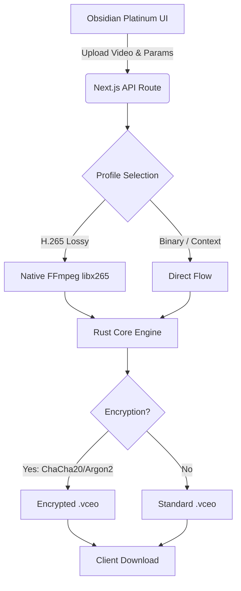

# 🎞️ Video Codec Studio: Obsidian Platinum (V5.1)

<div align="center">
  <p><strong>A high-performance, industrial-grade video transcoding and cryptographic encapsulation suite.</strong></p>
  
  
  
  
</div>

<br />

The **Video Codec Studio** is designed for extreme media compression, transcoding, and security. By uniting a custom **Rust Core Engine** with a high-fidelity **Next.js** workspace, it allows users to perform high-efficiency H.265 transcoding, Zstd dictionary compression, and ChaCha20Poly1305 authenticated encryption directly from a unified, premium interface.

---

## 🚀 Key Features

*   **⚡ Platinum Rust Engine**: A custom-built, compiled CLI engine (`video-codec`) utilizing the `zstd` crate for extreme byte-reduction. Engineered with an aggressive Memory-First policy ensuring zero-panic stability across arbitrary payloads.
*   **🎥 Real H.265 Lossy Transcoding**: Integrated `fluent-ffmpeg` pipeline that aggressively crushes video sizes using the `libx265` codec (Constant Rate Factor 28) before encapsulation.
*   **🔒 Industrial-Grade Encryption**: Secure your video bitstreams with **ChaCha20Poly1305** authenticated encryption. Keys are securely derived using the state-of-the-art memory-hard **Argon2id** algorithm.
*   **💎 Obsidian Platinum UI**: A premium, "clinical-dark" interface built with **React 19**, **Framer Motion**, and **Tailwind CSS (v4)**. Features real-time hardware status diagnostics, dynamic glow tokens, and a "security-first" header topology.
*   **🐳 Cloud-Native Architecture**: Fully Dockerized with multi-stage builds. Optimized for high-performance deployment on platforms like **Hugging Face Spaces**.

---

## 🏗️ System Architecture

The studio operates on a bifurcated architecture, handing off intensive computation to native binaries while managing the session via Node.js.



---

## 🛠️ Technology Stack

### Frontend (Studio Workspace)
*   **Framework**: Next.js 16 (App Router) / React 19
*   **Styling**: Tailwind CSS v4, Vanilla CSS Design Tokens
*   **Animation**: Framer Motion
*   **Icons**: Lucide React

### Backend & Orchestration
*   **Server**: Node.js (Edge-Compatible Route Handlers)
*   **Transcoding**: Fluent-FFmpeg, FFmpeg-Static
*   **Containerization**: Docker (Debian Bullseye Slim)

### Cryptographic Core Engine (`video-codec`)
*   **Language**: Rust (Edition 2024 Stable)
*   **Compression**: `zstd` (Levels 11 - 22 Platinum)
*   **Encryption**: `chacha20poly1305`, `argon2`, `rand`
*   **Serialization**: `serde`, `base64ct`

---

## ⚙️ Local Development Setup

To run the Video Codec Studio on your local machine, you will need **Node.js 20+** and **Rust/Cargo**.

### 1. Clone the Repository
```bash
git clone https://github.com/AshishLekhyani/Video-Codex.git
cd Video-Codex
```

### 2. Build the Rust Engine
The Next.js API expects the engine to be compiled as a release binary.
```bash
cd video-codec
cargo build --release
cd ..
```

### 3. Install Dependencies & Run
```bash
npm install
npm run dev
```
The studio will be live at `http://localhost:3000`.

---

## 🐳 Docker Deployment (Hugging Face Spaces)

This project includes a highly optimized, multi-stage `Dockerfile` designed specifically for seamless cloud deployment (like Hugging Face Spaces free tier).

It automatically handles:
1. Compiling the Rust Engine natively.
2. Building the Next.js application in `standalone` mode.
3. Installing native Linux `ffmpeg` libraries into the final Alpine/Debian runtime.

**To deploy to Hugging Face:**
Simply create a new Docker Space and push this repository. The `Dockerfile` exposes port `7860` natively.

---

## 🌐 Live Demo

This studio is currently live, running the full Rust+FFmpeg pipeline on Hugging Face Spaces:
👉 **[View Live Demo](https://ashishlekhyani-video-codex.hf.space)**

---

## 📜 License

This project is licensed under the **MIT License**. See the `LICENSE` file for details.

---

<div align="center">
  <em>Developed with ❤️ by Ashish Lekhyani</em>
</div>
