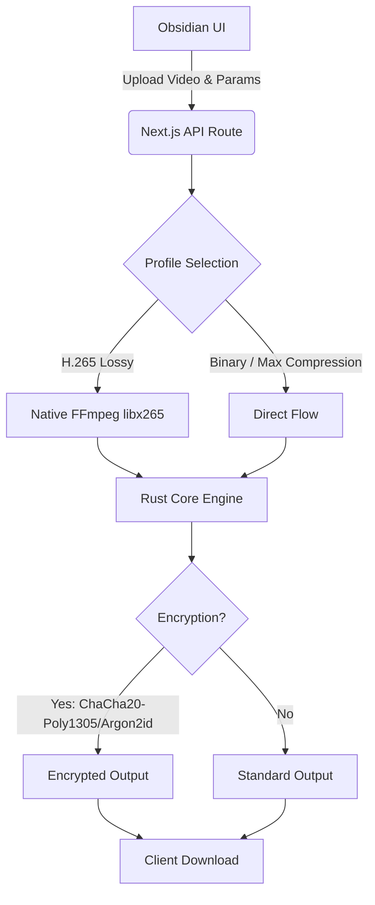

# 🎞️ Video Codec Studio (v1.0.1)

<div align="center">
  <p><strong>A video transcoding and cryptographic encapsulation suite, built on Rust + FFmpeg.</strong></p>
  
  
  
  
</div>

<br />

The **Video Codec Studio** handles media compression, transcoding, and encryption. It pairs a custom **Rust core engine** with a **Next.js** workspace to run H.265 transcoding, Zstd compression, and ChaCha20-Poly1305 authenticated encryption, all from one interface. All processing is CPU-bound — there is no GPU acceleration.

---

## 🚀 Key Features

*   **⚡ Rust Compression Engine**: A compiled CLI engine (`video-codec`) using the `zstd` crate at levels 11-22 depending on the selected profile. No unsafe code; failures return errors instead of panicking.
*   **🎥 Real H.265 Lossy Transcoding**: An `fluent-ffmpeg` pipeline transcodes with `libx265`, mapping the UI's quality slider to a continuous CRF range (18-35) before Zstd wraps the result.
*   **🔒 Real Encryption**: Video bitstreams can be sealed with **ChaCha20-Poly1305** authenticated encryption. Keys are derived per-file with **Argon2id** (64MB memory, 3 passes).
*   **🖤 Obsidian UI**: A dark, "clinical" interface built with **React 19**, **Framer Motion**, and **Tailwind CSS v4**. Status readouts reflect the actual pipeline in use — no simulated hardware stats.
*   **🐳 Cloud-Native Architecture**: Fully Dockerized with multi-stage builds. Deploys to platforms like **Hugging Face Spaces**.

---

## 🏗️ System Architecture

The studio operates on a bifurcated architecture, handing off intensive computation to native binaries while managing the session via Node.js.


```mermaid
graph TD
    A[Obsidian UI] -->|Upload Video & Params| B(Next.js API Route)
    B --> C{Profile Selection}
    C -->|H.265 Lossy| D[Native FFmpeg libx265]
    C -->|Binary / Max Compression| E[Direct Flow]
    D --> F[Rust Core Engine]
    E --> F
    F --> G{Encryption?}
    G -->|Yes: ChaCha20-Poly1305/Argon2id| H[Encrypted Output]
    G -->|No| I[Standard Output]
    H --> J[Client Download]
    I --> J
```

---

## 🛠️ Technology Stack

### Frontend (Studio Workspace)
*   **Framework**: Next.js 16 (App Router) / React 19
*   **Styling**: Tailwind CSS v4, Vanilla CSS Design Tokens
*   **Animation**: Framer Motion
*   **Icons**: Lucide React

### Backend & Orchestration
*   **Server**: Node.js (Edge-Compatible Route Handlers)
*   **Transcoding**: Fluent-FFmpeg, FFmpeg-Static
*   **Containerization**: Docker (Debian Bookworm Slim)

### Cryptographic Core Engine (`video-codec`)
*   **Language**: Rust (Edition 2021)
*   **Compression**: `zstd` (Levels 11, 22 depending on profile)
*   **Encryption**: `chacha20poly1305`, `argon2`, `rand`
*   **Serialization**: `serde`, `base64`

---

## ⚙️ Local Development Setup

To run the Video Codec Studio on your local machine, you will need **Node.js 20+** and **Rust/Cargo**.

### 1. Clone the Repository
```bash
git clone https://github.com/AshishLekhyani/Video-Codex.git
cd Video-Codex
```

### 2. Build the Rust Engine
The Next.js API expects the engine to be compiled as a release binary.
```bash
cd video-codec
cargo build --release
cd ..
```

### 3. Install Dependencies & Run
```bash
npm install
npm run dev
```
The studio will be live at `http://localhost:3000`.

---

## 🐳 Docker Deployment (Hugging Face Spaces)

This project includes a highly optimized, multi-stage `Dockerfile` designed specifically for seamless cloud deployment (like Hugging Face Spaces free tier).

It automatically handles:
1. Compiling the Rust Engine natively.
2. Building the Next.js application in `standalone` mode.
3. Installing native Linux `ffmpeg` into the final Debian slim runtime.

**To deploy to Hugging Face:**
Simply create a new Docker Space and push this repository. The `Dockerfile` exposes port `7860` natively.

---

## 🌐 Live Demo

This studio is currently live, running the full Rust+FFmpeg pipeline on Hugging Face Spaces:
👉 **[View Live Demo](https://ashishlekhyani-video-codex.hf.space)**

---

## 📜 License

This project is licensed under the **MIT License**. See the `LICENSE` file for details.

---

<div align="center">
  <em>Developed with ❤️ by Ashish Lekhyani</em>
</div>
